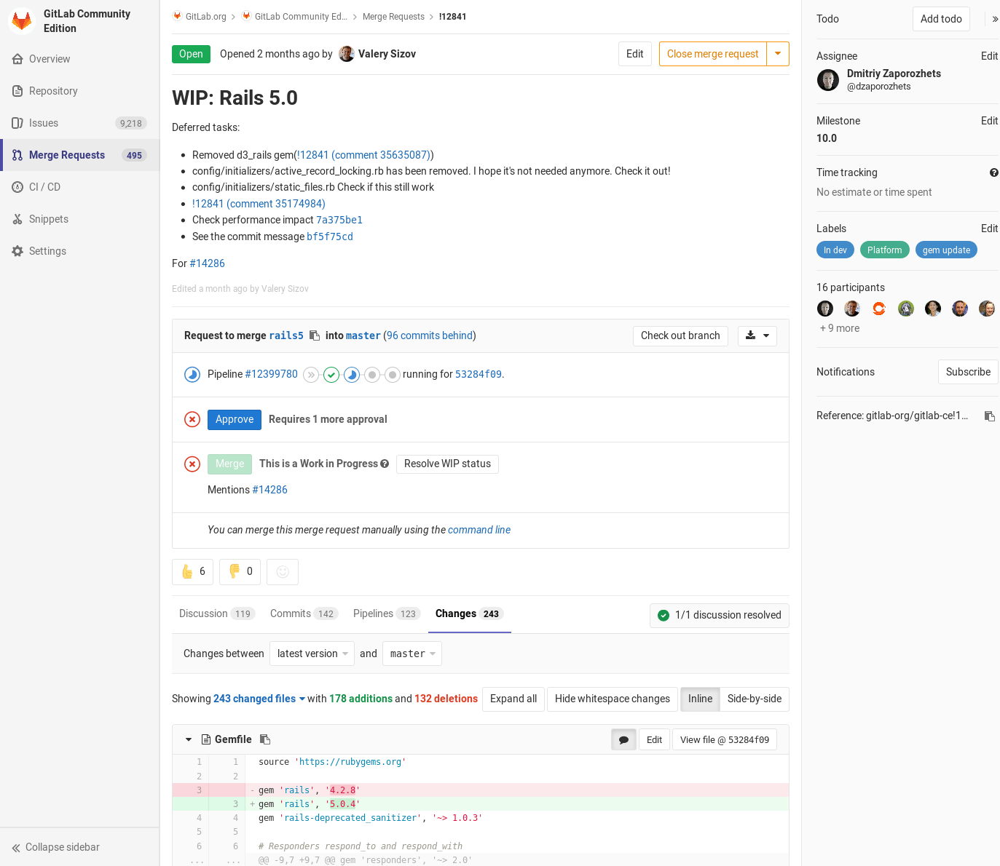

## salsa.debian.org - state of affairs

### a journey from alioth to salsa

---

## Who am I?

@ul[squares]

- I am the guy that rejects your mails on lists.debian.org
- I am the guy that rejects your backports
- I am the guy that will destroy alioth.debian.org

@ulend

+++

## And otherwise?

@ul[squares]

- working as OpenSource consultant at credativ
- father of two wonderful girls
- RPG and Tabletop nerd

@ulend

---

## A little bit of history

@ul[squares]

- @debconf15 we had a discussion about the security problems of collab-maint
- 2015-2017 Evaluation of gitolite
- May 2017 - debian-devel thread about "Moving away from fusionforge"
- Jun 2017 - survey about the alioth replacement
- Evaluation of pagure, gitlab and gogs/gitea
- August 2017 Alioth Sprint in Hamburg
- "add salsa image"
- 2017-11-01 gitlab removes CLA
- 2017-12-25 salsa going into public beta
- 2018-01-27 salsa leaving beta
- 2018-05-01 user and project creation disabled
- 2018-05-12 {bzr,hg,darcs}.debian.org disabled
- 2018-05-18 project websites disabled
- 2018-05-31 all other version control systems will get disabled
- 2018-06-01 alioth.debian.org is no more

@ulend

--- 

## Some numbers

@ul[squares]

- ~23.700 Repos
- ~3200 Users
- ~400 Groups
- ~90 Gigabytes disk space used
@ulend

---

## future plans

@ul[squares]

- Docker Registry
- More Runners
- Devops (needs sponsor!)
- integration with sso.debian.org

@ulend

---

## what we left behind

- shells
- cronjobs
- custom domains
- darcs, git, bzr, cvs, svn

---

## what we got instead

---

## collaboration

+++

### Merge requests

People can fork and collaborate on packages / repositories. That allows contribution without being
a member of a project and mailing around patches. It also allows code review and commenting of patches.

+++



+++

<iframe width="630" height="394" src="https://www.useloom.com/embed/8c9e3569437c4cae933b7464875c7c6d" frameborder="0" webkitallowfullscreen mozallowfullscreen allowfullscreen></iframe>


---

## Issues

You can track todo items or bugs (this it **not** intended for debian packaging and should **not** replace the BTS) with the builtin issue tracker. 

You can also reply by mail to an issue.

+++

### close issues by merge request

```
Closes #333, #444, #555 and #666
```

you can even close issues in other repos

```
Closes #333, #444, and 
 https://gitlab.com/<username>/<projectname>/issues/<xxx>
```

* Close, Closes, Closed, Closing, close, closes, closed, closing
* Fix, Fixes, Fixed, Fixing, fix, fixes, fixed, fixing
* Resolve, Resolves, Resolved,Resolving, resolve, resolves, resolved, resolving

+++

### create issue by mail

<iframe width="630" height="394" src="https://www.useloom.com/embed/6fdf9ac7a0f4402cb781e4f728df3755" frameborder="0" webkitallowfullscreen mozallowfullscreen allowfullscreen></iframe>

---

## webhooks

Webhooks can be used to react to events in your repository, like:

* IRC Notifications
* Automatically close or tag bugs
* Trigger external CI/QA systems like jenkins or sonarqube

+++

### providing webhooks

we run an webhook server for salsa.debian.org. If you want us to run your webhook, provide
a patch to our repository at [salsa](https://salsa.debian.org/salsa/webhook)
Documentation is provided in the [Debian Wiki](https://wiki.debian.org/Salsa/Doc#Dealing_with_Debian_BTS_from_commit_messages)

+++

**Currently provided hooks**:

* tagpending - tag bugs as pending if you mention them in your changelog
* close - close bugs mentioned in your changelog

---

## Gitlab CI / CD

Gitlab CI/CD is a powerful continues integration / continues development system that allows developers
to build, test and eventually deploy software and/or packages from within gitlab. That allows developers
to find problems in their packages soon.

+++

### runners

Salsa provides two docker based runners for projects and salsa, but every project can add its own runners if
they want to. 

** Please be kind to our runners! **
+++

### How to use it? 

* add a gitlab-ci.yml file to your repo
* ehm, thats it. Watch your pipeline happening. 

+++?gist=formorer/cd32cfbdf5932caad052ca4d14a35efa&lang=YAML

+++

### That was too hard?

```yaml
image: registry.gitlab.com/eighthave/ci-image-git-buildpackage:latest

test:
  script:
    - /gitlab-ci-git-buildpackage
```

---

## gitlab pages

salsa allows you to hosts project pages under *.pages.debian.net

```yaml
pages:
  stage: deploy
  script:
  - echo 'Nothing to do...'
  artifacts:
    paths:
    - public
  only:
  - master
```
+++

### hugo website

```yaml
image: registry.gitlab.com/pages/hugo:latest

variables:
  GIT_SUBMODULE_STRATEGY: recursive

test:
  script:
  - hugo
  except:
  - master

pages:
  script:
  - hugo
  artifacts:
    paths:
    - public
  only:
  - master
```

---

## web editor

<iframe width="630" height="394" src="https://www.useloom.com/embed/0e95cdd80088473695b80a3eb765106e" frameborder="0" webkitallowfullscreen mozallowfullscreen allowfullscreen></iframe>

---

## API

---


---

## 2factor auth

### how it works
### recover your keys

--- 

## some internals about godard and ansible